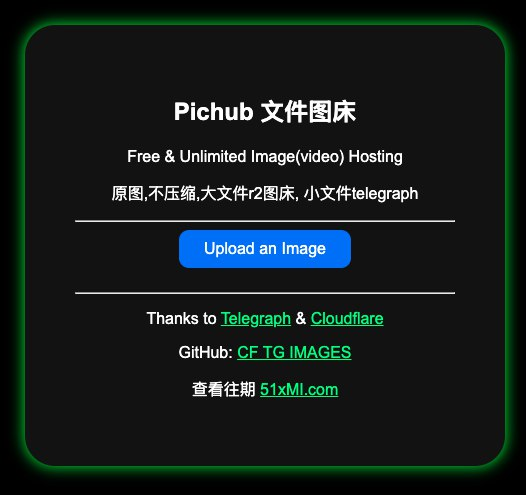

# **🚀 零 SQL 基础！用 Cloudflare Worker + R2 + D1 打造个人专属图床**

本教程将手把手带你基于 Cloudflare 免费服务搭建一套高并发、支持哈希防重秒传、自带瀑布流媒体库的专属图床。**无需任何 SQL 编写基础，全界面点击即可完成部署！**

---

## **🌟 图床亮点**

- **💰 完全免费**：充分利用 Cloudflare Worker、R2 对象存储与 D1 数据库的大额免费额度。
- **⚡ 秒传去重**：上传时自动计算文件 SHA-256 哈希，重复图片无需重复占用存储空间。
- **🖼️ 瀑布流媒体库**：自带隐藏的后台可视化图片/视频管理页面 (`/secret-gallery`)。
- **📱 捷径支持**：支持 iPhone / iPad / Mac 系统快捷指令一键上传并自动复制图片链接。
- **🛠️ 免 SQL 建表**：代码内置数据库自动初始化逻辑，绑定好 D1 数据库即可使用。

---

## **🛠️ 第一步：创建 R2 存储桶 (存储文件)**

1. 登录 Cloudflare 控制台。
2. 在左侧菜单点击 **存储和数据库** ➡️ **R2**
3. R2要绑定银行卡, 储蓄卡和信用卡都可以,免费额度很大, 不会扣费。
4. 点击 **创建存储桶 (Create Bucket)**：
    - 存储桶名称：例如 `pichub-bucket`（可自定义）。
    - 点击 **创建** 即可。

---

## **🛠️ 第二步：创建 D1 数据库 (存储索引)**

1. 在左侧菜单点击 **存储和数据库** ➡️ **D1**。
2. 点击 **创建数据库 (Create Database)**：
    - 数据库名称：例如 `pichub-db`（可自定义）。
    - 点击 **创建** 即可。
    
    > 💡 **提示**：创建完成后无需手动运行任何 SQL 语句，代码会自动创建数据表！
    > 

---

## **🛠️ 第三步：创建 Worker 并绑定资源**

1. 在左侧菜单点击 **Compute (Worker 和 Pages)** ➡️ **创建应用程序 (Create Application)** ➡️ 点击 **创建 Worker**。
2. 为你的 Worker 命名（如 `my-pichub`），点击 **部署 (Deploy)**。
3. 部署完成后，点击右上角的 **编辑代码 (Edit code)**：
    - 将现有默认代码全部清空。
    - 粘贴本项目的 `worker.js` 完整代码。
    - 点击右上角 **部署 (Deploy)**。

---

## **⚙️ 第四步：配置环境变量与资源绑定 (关键步骤)**

退回到你的 Worker 设置页面，点击 **设置 (Settings)** 选项卡：

### **1. 添加环境变量 (Variables)**

在 **Variables and Secrets** 区域，点击 **添加 (Add)**：

- 变量 1：`DOMAIN` ➡️ 值填你的r2的域名（如 `https://r2.yourdomain.com`，末尾不带 `/`）。
- 变量 2：`APIKEY` ➡️ 值填你设定的访问密钥/密码（用于保护上传接口与媒体库）。

### **2. 绑定 R2 存储桶 (R2 Bucket Bindings)**

在 **R2 Bucket Bindings** 区域，点击 **添加绑定 (Add binding)**：

- **变量名称 (Variable name)**：必须填 `myr2`
- **R2 存储桶 (R2 Bucket)**：选择第一步创建的 `pichub-bucket`

### **3. 绑定 D1 数据库 (D1 Database Bindings)**

在 **D1 Database Bindings** 区域，点击 **添加绑定 (Add binding)**：

- **变量名称 (Variable name)**：必须填 `myd1`
- **D1 数据库 (D1 Database)**：选择第二步创建的 `pichub-db`

> ⚠️ **注意**：配置完变量和绑定后，务必再次点击 **保存并部署 (Save and Deploy)** 使配置生效！
> 

---

## **🎉 第五步：开始使用**

### **1. 打开前端上传页面**

访问你的 Worker 域名或绑定的自定义域名：

```
text
https://pichub.yourdomain.com/
```

在页面中输入你刚才设置的 `APIKEY`，即可拖拽选择图片/视频上传！

### **2. 打开秘密瀑布流媒体库**

访问隐秘媒体库路径：

```
text
https://img.yourdomain.com/secret-gallery
```

输入 `APIKEY` 即可浏览所有已上传的图片与视频，支持一键点击复制链接。

---

## **💡 进阶优化提示（可选）**

代码中自带了**免 SQL 建表**机制（第一次发起请求时会自动在 D1 中生成 `images` 表）。如果你后续熟悉了 SQL，且希望追求极限性能，可以在 `worker.js` 代码中找到以下 3 行并加 `//` 注释掉：

```
javascript
// await initDatabase(env);
```

## 图床演示地址

https://pichub.51xmi.com/

nexteek专用图床

---

## **📲 进阶优化 2：苹果快捷指令（Shortcuts）一键传图**

在 iPhone / iPad / Mac 上，你可以使用系统自带的 **快捷指令** App 配置“一键传图到图床”，上传成功后自动将图片链接复制到剪贴板！

### **快捷指令配置步骤：**

1. 打开 Apple **快捷指令** App，新建一个快捷指令，重命名为 **`发给图床`**。
2. 开启 **“在共享表单中显示 / 用作快速操作”**，设置接收类型包含 **App / 文件 / 照片**；设置“如果没有输入”时 ➡️ **选择照片 / 请求文件**。
3. 添加动作 **【获取 URL 内容】**：
    - **URL**：`https://你的域名/api/upload` （例如 `https://img.yourdomain.com/api/upload`）
    - **方法 (Method)**：`POST`
    - **标头 (Headers)**：添加 `Authorization`，值为你的 **`APIKEY`**
    - **请求主体 (Request Body)**：选择 **表单 (Form)**
        - 键 (Key)：`file`
        - 值 (Value)：选择 **【快捷方式输入】**（或上一步选中的文件/照片）
4. 添加动作 **【获取词典值】**：
    - 从 **【获取 URL 内容】** 的结果中获取键 **`optimizedUrl`** 的值（若不需要 CDN 压缩链接也可选 `url`）。
5. 添加动作 **【拷贝至剪贴板】**：
    - 将上一步获得的词典值拷贝至剪贴板。
6. 添加动作 **【显示结果 / 显示通知】**：
    - 提示上传成功并展示图片链接。

!发送给图床.png

> 💡 **使用效果**：在相册或任何地方选中图片点击“共享” ➡️ 选择 **“发给图床”** ➡️ 几秒后链接已自动保存在剪贴板中，可以直接 `Cmd+V` 或粘贴发送！
>

## 单一文件workers图床.直接把代码copy过去就可以了

###  自带前端界面
###  绑定d1数据库,绑定R2存储
## 演示地址

## https://pichub.51xmi.com
 
 
 
- 打开cloudflare CF网站, 
- 点左面的workers and pages. 创建应用程序 
- 创建 workers, 名称处改一个好记的, 占右下角的部署 
- 编辑代码 直接替换
- 设置 增加一个自定义域
- 设置 增加两个变量, 一个DOMAIN = 你r2存储桶的自定义域名, 另一个 APIKEY = 密码
- 设置 绑定,增加d1,增加R2绑定
 


## 可以用如下命令行直接新建D1数据库

第一步, 新建 images 表, 做为记录
CREATE TABLE IF NOT EXISTS images (
    id TEXT PRIMARY KEY,
    original_name TEXT NOT NULL,
    stored_name TEXT NOT NULL UNIQUE,
    size INTEGER,
    mime_type TEXT,
    file_hash TEXT, -- 新增的哈希字段
    upload_time DATETIME DEFAULT CURRENT_TIMESTAMP
);
第二步,index
CREATE INDEX IF NOT EXISTS idx_images_hash ON images(file_hash);
